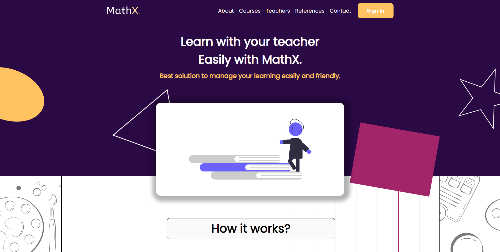
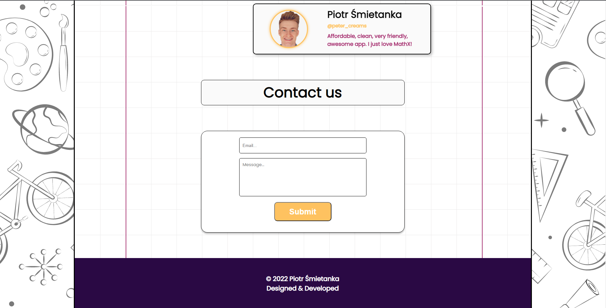
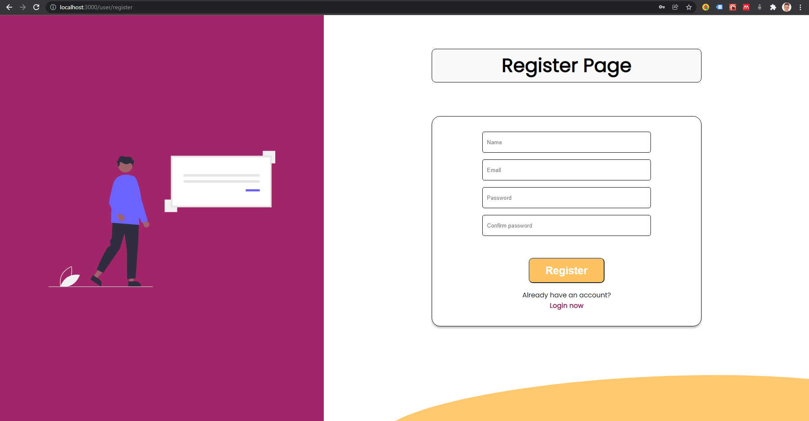
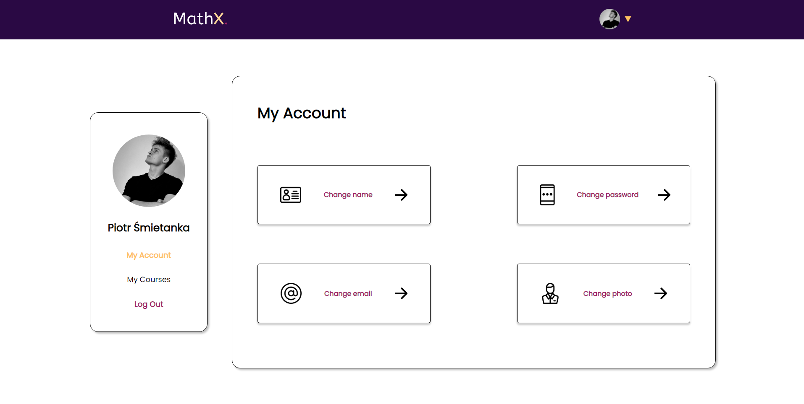
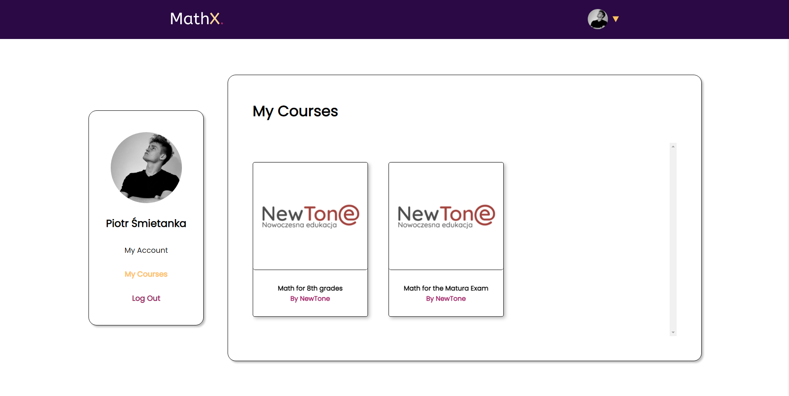
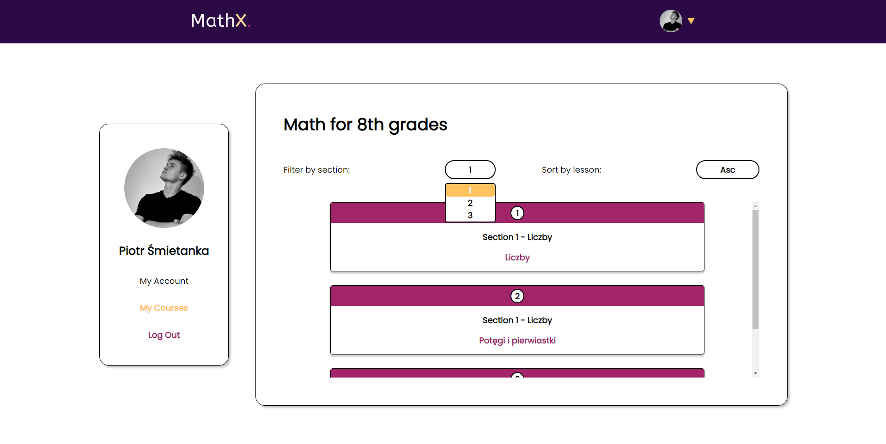
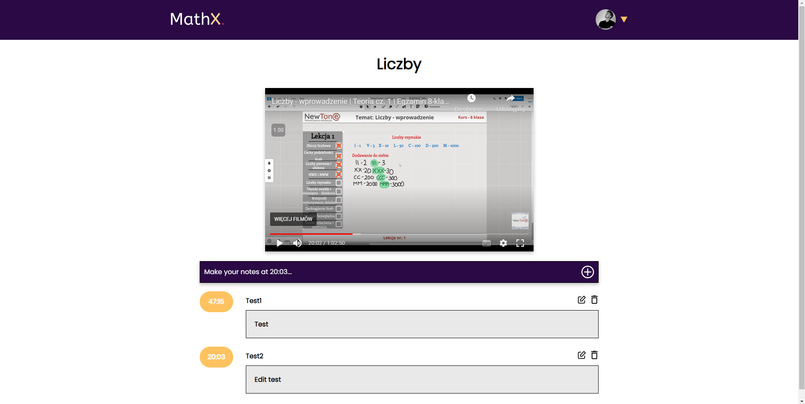

# Learning Management System Demo

This project is a demo, MVP (Minimum Viable Product) version of commercial LMS for NewTone - e-learning company.

## Table of Contents
* [General info](#general-info)
* [Technologies](#technologies)
* [Launch](#launch)

## General Info

This commercial project has been in development since September 2021. This is the first version, intended for presentation. Currently, the project is in the process of merging with Django on the server side.

**The entire project was designed by me at Figma.**

**Designed Mobile & Desktop Viewport.**

### Available features:
#### Landing Page
* Simple Landing Page
* Contact form connected with Firebase Firestore Database




#### Register/Login Panel

* Login to your account / Create new account via Firebase auth



#### Change of basic user data
* Change username
* Change email
* Change password
* Change profile photo


#### Course Panel
* Show user's courses
* Connected with Firebase Firestore Database


#### Lessons Panel
* Show user's sections
* Filter by sections
* Sort lessons Asc or Desc
* Connected with Firebase Firestore Database



#### Lesson Panel
* Show lesson's video
* Save note at a given timestamp (each user has their own notes)
* Edit/Delete note
* After pressing timestamp the user is moved to the given fragment of the video
* Connected with Firebase Firestore Database




## Technologies
* Next.js 11
* SASS
* Firebase

## Launch
To run this project, just open it in the browser:
```
https://edu-platform.vercel.app/
```
### Demo account:
**E-mail:** test@test.com
**Password:** 123456
